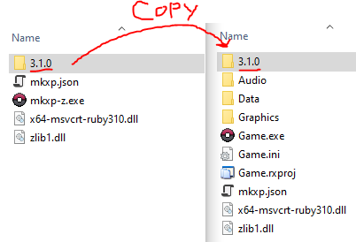
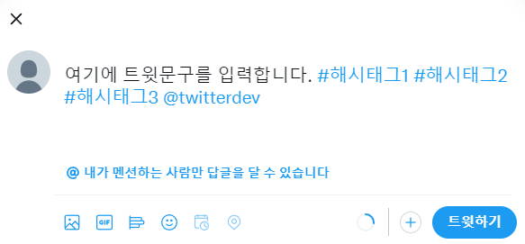
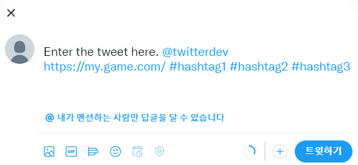
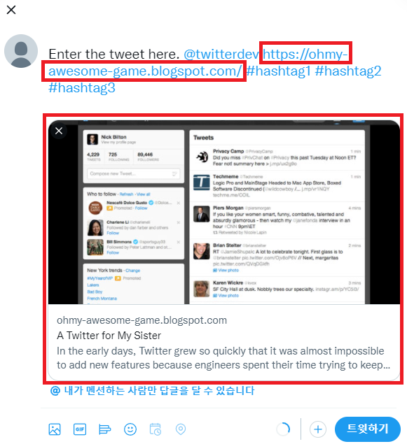
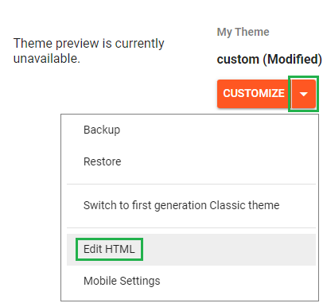
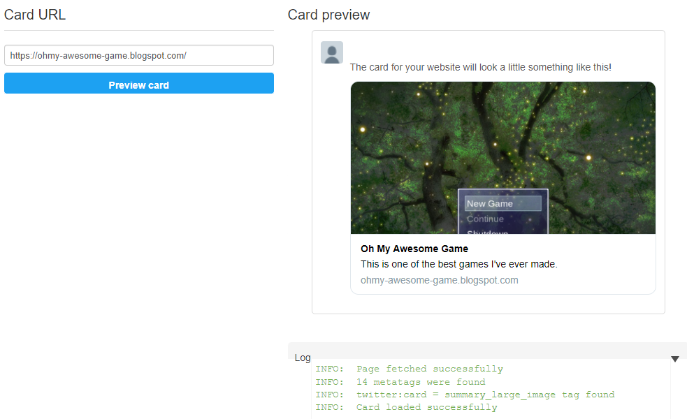
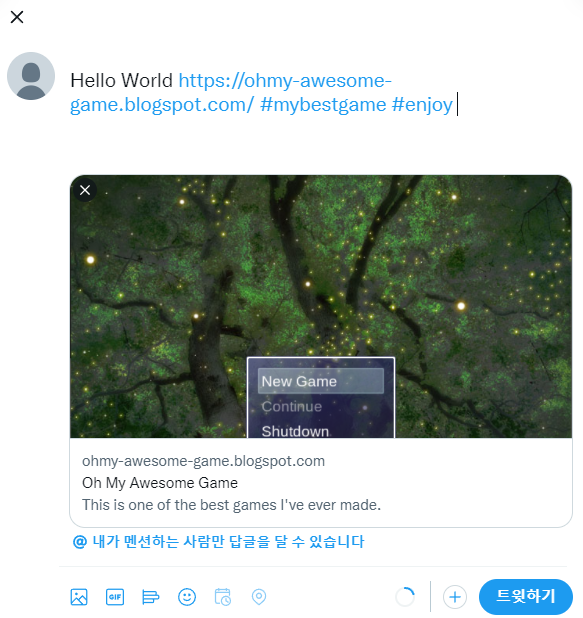

# TweetBrowser

## 소개
웹 브라우저로 Twitter의 Tweet Thread 작성 화면을 실행하는 간단한 스크립트입니다. 사용자 컴퓨터에서 지정된 기본 웹 브라우저를 실행합니다. 웹 브라우저의 트위터가 로그인 된 상태에서 동작합니다.

## 호환성
> 아래의 변경사항이 있다면 Issue 또는 PR로 남겨주십시오.
### RGSS interface
- [x] mkxp-z
- [ ] original (Enterbrain, KADOKAWA)
### OS Platform
- [x] Windows
- [ ] macOS (미확인)
- [ ] Linux (미확인)
### RPG Maker
- [x] XP
- [ ] VX (미확인)
- [ ] VXA (미확인)

## 적용하기
> mkxp-z 를 적용했다는 가정하에 진행합니다. 
1. [mkxp-z 릴리즈](https://gitlab.com/mkxp-z/mkxp-z/-/releases)를 다운로드 하고 압축을 풉니다.
2. ruby 라이브러리 폴더를 게임 프로젝트 폴더로 복사합니다. 여기서는 **ruby 3.1.0** 버전을 사용합니다. 

3. [tweet_browser.rb](tweet_browser.rb)를 스크립트 에디터에 붙여넣습니다.

4. 아래 사용법을 읽고 테스트합니다.

## 사용법

### 함수 원형
```ruby
TweetBrowser.tweet([text: String], [url: String], [hashtags: Array|String]))
```
* text: 트윗에 적을 텍스트입니다. 이것만으로도 해시태그, 링크, 사용자 어노테이션 모두 할 수 있습니다.
* url: link 주소입니다.
* hashtags: 해시태그 리스트입니다.
* argument들의 순서가 바뀌어도 상관 없습니다.

### Option #1: 쉽게 사용하기

```ruby
TweetBrowser.tweet(text: "여기에 트윗문구를 입력합니다. #해시태그1 #해시태그2 #해시태그3 @twitterdev")
```

### Option #2: keyword argument 별로 지정하여 사용하기

```ruby
TweetBrowser.tweet(
  text: "Enter the tweet here. @twitterdev",
  url: "https://my.game.com/",
  hashtags: ["hashtag1", "hashtag2", "hashtag3"],
)
```
해시태그는 아래처럼 comma로 구분하여 지정할 수도 있습니다.
```ruby
TweetBrowser.tweet(
  ...
  hashtags: "hashtag1,hashtag2,hashtag3",
)
```

## Link 카드 확장하기

쓰레드에 텍스트만 보인다면 밋밋해 보일 수 있습니다. 어떤 링크를 트윗에 삽입하면, 자동으로 카드 형식의 사진과 설명을 남길 수 있습니다. 이것은 그 사이트의 Open Graph 메타 태그를 추가했기 때문에 가능한 일입니다.



따라서 **HTML 코드 수정**이 가능한 블로그 또는 사이트를 갖고 있다면, Open Graph 메타 태그를 입력하여 카드 컨텐츠를 커스터마이징할 수 있습니다. 여기서는 무료로 블로그를 호스팅할 수 있는 서비스인 Google Blogger로 진행하겠습니다.

---

1. [Google Blogger](https://blogger.com/)에 접속하여 블로그를 하나 생성합니다.

2. Theme 메뉴로 들어가서 화살표를 누르고 `Edit HTML`을 선택합니다. 

3. 적당한 위치에 Open Graph 메타 태그 코드를 삽입하고 수정합니다.

**예제 코드** ([원본](https://developer.twitter.com/en/docs/twitter-for-websites/cards/guides/getting-started#opengraph))
```html
<meta content='summary_large_image' name='twitter:card'/>
<meta content='https://ohmy-awesome-game.blogspot.com/' property='og:url'/>
<meta content='Oh My Awesome Game' property='og:title'/>
<meta content='This is one of the best games I&apos;ve ever made.' property='og:description'/>
<meta content='https://user-images.githubusercontent.com/15997924/152666673-7ea81f0f-d435-4ef9-8d57-bd3ff6ea4903.png' property='og:image'/>
```
4. https://cards-dev.twitter.com/validator 에 접속합니다.
5. Card URL 입력칸에 블로그 Link를 기입하고 Preview card 버튼을 누릅니다. 아래 사진처럼 보이는 경우 성공입니다. 
> 만약 태그를 수정했는데도 반영이 안 된다면 태그를 모두 지우고 저장 후, 다시 태그를 기입해서 저장하십시오.
6. 스크립트를 실행합니다.
```ruby
TweetBrowser.tweet(
  text: "Hello World",
  url: "https://ohmy-awesome-game.blogspot.com/",
  hashtags: ["mybestgame", "enjoy"],
)
```


이렇게 게임을 다른 사람들에게 홍보하는 효과를 낼 수 있습니다.